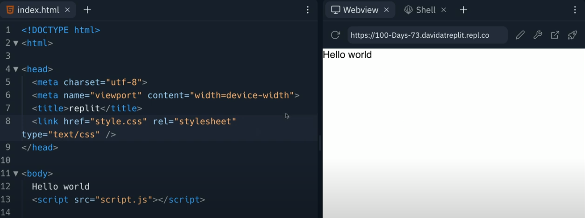

# Hyper Text Markup Language

Over the next couple of days, we'll be taking a crash course in **HTML** (Hyper Text Markup Language).

HTML is a **markdown** language. This means that it is used to tell webpages how to render on screen (basically how to look).

It is made up of a series of instructions in  `<tags>` that surround text/image filenames, etc. and influence how they are displayed on screen.

Starting an HTML repl gives us some useful boilerplate starter code. Instead of the console, we get a web view on the right so we can see how the code will look in a browser.



## Tags
Now let's start creating a webpage and learning about the tags.

👉 Step 1 is to tell the file that this is an HTML page.  These are the **first** and **last** tags on your page.

Notice that the **last** tag has a forward slash before the command.  This means **close** or end this tag.  With a few exceptions, tags come in pairs - an **opening** tag (no /) and a **closing** tag (with a /).

```html
<html>

  
</html>
```

## Head

The `<head>` tags contain a lot of invisible information about the page that you won't see on screen. Stuff like:
- How to display your webpage on different devices (desktop vs. mobile device)
- Keywords

The tag that we really care about inside head is the `<title>` tag.  You do sort of see this on screen. It's the text that goes in the tab of the web page.

Also notice the indentation. This **doesn't affect the way the code works** like it does in Python, but it is standard practice to show how some tags are inside others.  It also makes the code *much easier to read*.

👉 Let's create the head and title:
```html
<html>

  <head>
    <title>David's World Of Baldies</title>
  </head>
  
</html>
```
As soon as you start building with Replit, your site is **already on the world wide web!**

Copy the URL into a new browser tab or just click the 'Open in a new tab' button to see it!


Now we can see that our text is on the tab of the webpage.


## Body

The visible contents of the page go in the `<body>` tag:
```html
<html>

  <head>
    <title>David's World Of Baldies</title>
  </head>


  <body>
  
  </body>
  
</html>
```

### Headings
👉 Time for headings. This is the `<h>` tag.  There are lots of different pre-defined heading sizes. They are numbered, with 1 being the largest.

```html
<html>

  <head>
    <title>David's World Of Baldies</title>
  </head>


  <body>
    <h1>Dave's World of Baldies</h1>
    <h2>Welcome to our website!</h2>
  </body>
  
</html>

```
Once you've added the code, **refresh the web view page** using the internal refresh button to show your changes.

Play around with headings for a while to see what the different sizes look like.

### Paragraphs
👉 The `<p>` tag creates **paragraph** text.  Each new `<p>` tag will create a new paragraph with a vertical spacing from the line above. This will appear using your browser's default font settings. We'll learn about changing those in another lesson.

*From here, I'm just going to show the **body** section of the code to save room.*

```html
<body>
  <h1>Dave's World of Baldies</h1>
  <h2>Welcome to our website!</h2>

  <p>We all know that throughout history some of the greatest have been Baldies, let's see the epicness of their heads bereft of hair.</p>

  <h2>Gallery of Baldies</h2>
  <p>Here are some of the legends of the bald world.</p>
  
</body>
```


## Images

Inserting an image in HTML is a bit tricker than just copying and pasting.  We have to:
- Save the image in a folder
- Name it (ideally with no spaces)
- Tell the HTML where to find the image

👉 Let's insert an image.

1. Drag & drop the image from your local files to the repl files pane.


2. Rename it (KEEP THE FILE EXTENSION).


3. Use the `` tag in your HTML code to point to the image. The `src` part of the tag specifies the location and I can also set the width using % or pixels.
   

```html

<body>
  <h1>Dave's World of Baldies</h1>
  <h2>Welcome to our website!</h2>

  <p>We all know that throughout history some of the greatest have been Baldies, let's see the epicness of their heads bereft of hair.</p>

  <h2>Gallery of Baldies</h2>
  <p>Here are some of the legends of the bald world.</p>

  
  <p>Captain Jean Luc Picard: Baldest Star Trek captain, and legend.</p>
  
</body>

```

We've only got one image here, but if you have lots then your file pane will get messy very quickly.  Good practice is to keep your images in a folder (probably called **images**).


👉 However, if you do this, then you have to change the `src` tag to point to that folder first, like this:

```html

```

## Bullets

But what makes Picard such a great Baldy? To educate our audience, let's give them a list! 

👉 I'm going to use the `<ul>` (unordered list) to create a bullet point list.

If I used the `<ol>` tag instead, I'd get a numbered list.

The `<li>` tag means *list item*, and each item in the list gets one.

```html
<body>
  <h1>Dave's World of Baldies</h1>
  <h2>Welcome to our website!</h2>

  <p>We all know that throughout history some of the greatest have been Baldies, let's see the epicness of their heads bereft of hair.</p>

  <h2>Gallery of Baldies</h2>
  <p>Here are some of the legends of the bald world.</p>

  
  <p>Captain Jean Luc Picard: Baldest Star Trek captain, and legend.</p>

  <ul>
    <li>Beautiful bald man</li>
    <li>Calm and cool under pressure</li>
    <li>All the Picard memes</li>
  </ul>
  
</body>

```

## Linky Linky

To link between webpages, we need another page, so let's quickly make one:


👉 Now, we can link to it. I've used the `<a href>` tag to create a link at the bottom of my page.

The `href` argument specifies the location of the webpage being linked. It's short for 'hypertext reference'.

```html
<body>
  <h1>Dave's World of Baldies</h1>
  <h2>Welcome to our website!</h2>

  <p>We all know that throughout history some of the greatest have been Baldies, let's see the epicness of their heads bereft of hair.</p>

  <h2>Gallery of Baldies</h2>
  <p>Here are some of the legends of the bald world.</p>

  
  <p>Captain Jean Luc Picard: Baldest Star Trek captain, and legend.</p>

  <ul>
    <li>Beautiful bald man</li>
    <li>Calm and cool under pressure</li>
    <li>All the Picard memes</li>
  </ul>

  <p><a href = "page2.html">Go to page 2</a></p>
  
</body>
```

👉 If I wanted to link to an external site about Picard, I'd just grab the **full page URL** and put that as the `href` argument.  Like this: 
```html
<p><a href = "https://memory-alpha.fandom.com/wiki/Star_Trek:_Picard">Captain Jean Luc Picard: Baldest Star Trek captain, and legend.</a></p>
```

To link an **image**, I would surround the `` tags with `<a>` tags.
### Try it out!